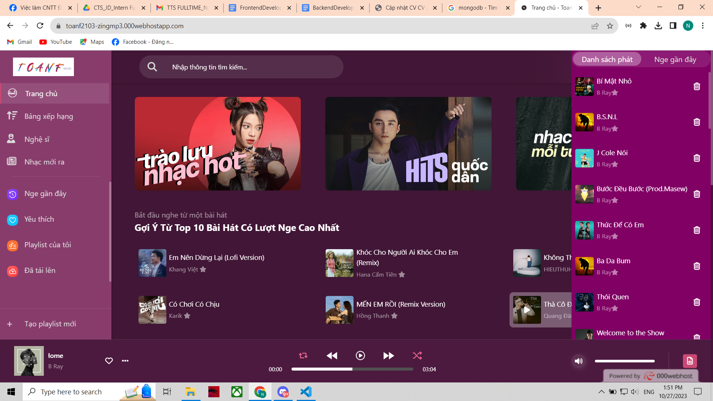

<h1 align="center"> Toanf Zing mp3 </h1>


# Technology And Programing Language

-   PHP
-   Laravel
-   Boostraps 5


# Features

-   Auth(Register, Login, Logout)

*   Customer

1.  Search music
2.  Folow artist
3.  Like music
4.  Listen music
4.  Change profile


-   ADMIN


## How to run project

### Step 1: Clone project

Clone project and move project to htdocs

### Step 2: Install.

```bash
composer install
```
### Step 3: Create DB:
Create DB and import file database in Database

### Step 4: Create environment:
Create file .env and copy .env.example


### Account

<details>
    <summary><strong>Admin account:</strong></summary>
    <p>Account: admin</p>
    <p>Password: 1</p>
</details>


Thank you.



